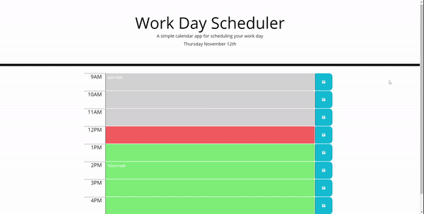

# Workday-Scheduler
Users are able to keep track of their tasks throughout a normal 9am-5pm workday. The schedule will let the user know the current hour, past hours, and future. If the user refreshes the page, the tasks will still be save onto the website. 

### Schedule Details
```
> color-coded past, present, and future (will reset at midnight)
    > past: gray
    > present hour: red
    > future: green
> save icon will save to-dos entered in description box
```

### Mock-Example vs Actual

##### Mock-Example


##### Actual


### URL of Depoloyed Application

:point_right:  [oliva-sam.github.io/bootcamp/workday-scheduler](https://oliva-sam.github.io/05-Workday-Scheduler/)  :point_left:
